### Escuela Colombiana de Ingeniería
### Arquitecturas de Software - ARSW

### Andrea Valentina Torres Tobar

### Andres Serrato Camero

## Escalamiento en Azure con Maquinas Virtuales, Sacale Sets y Service Plans

### Dependencias
* Cree una cuenta gratuita dentro de Azure. Para hacerlo puede guiarse de esta [documentación](https://azure.microsoft.com/es-es/free/students/). Al hacerlo usted contará con $100 USD para gastar durante 12 meses.
Antes de iniciar con el laboratorio, revise la siguiente documentación sobre las [Azure Functions](https://www.c-sharpcorner.com/article/an-overview-of-azure-functions/)

### Parte 0 - Entendiendo el escenario de calidad

Adjunto a este laboratorio usted podrá encontrar una aplicación totalmente desarrollada que tiene como objetivo calcular el enésimo valor de la secuencia de Fibonnaci.

**Escalabilidad**
Cuando un conjunto de usuarios consulta un enésimo número (superior a 1000000) de la secuencia de Fibonacci de forma concurrente y el sistema se encuentra bajo condiciones normales de operación, todas las peticiones deben ser respondidas y el consumo de CPU del sistema no puede superar el 70%.

### Escalabilidad Serverless (Functions)

1. Cree una Function App tal cual como se muestra en las  imagenes.

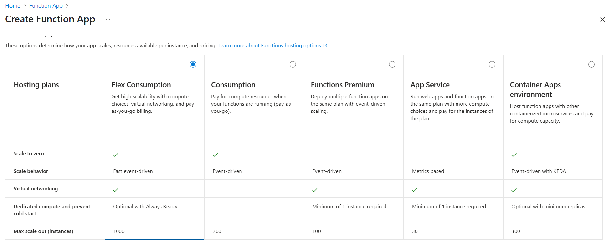

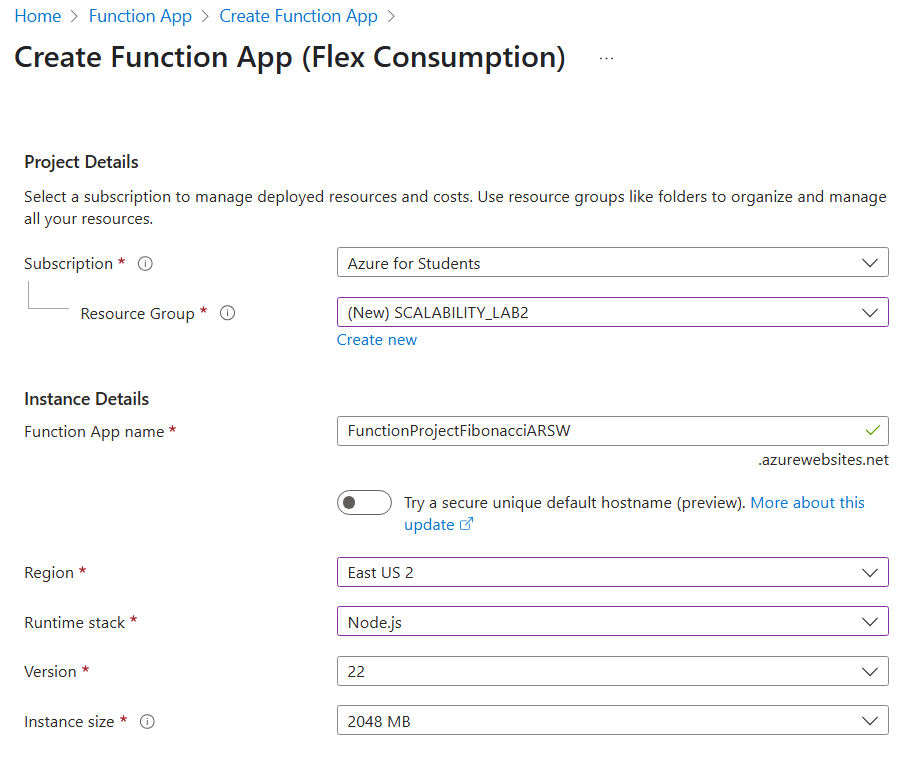

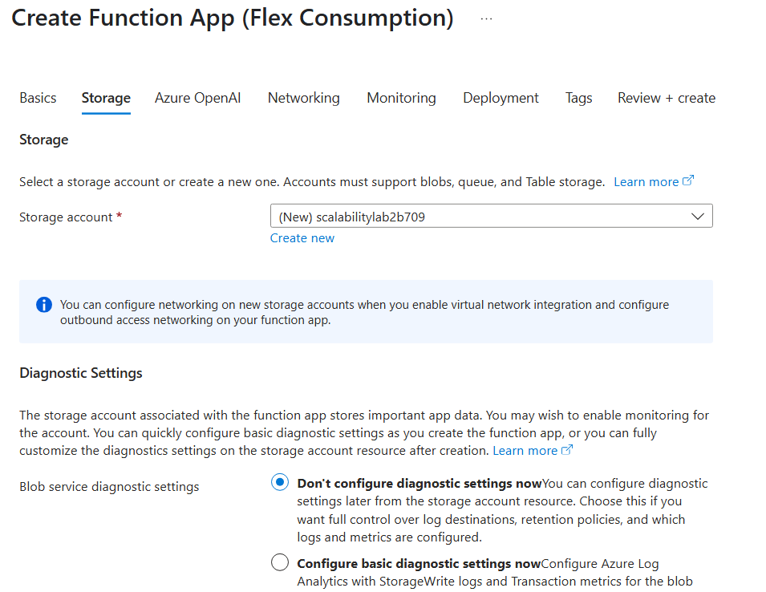

2. Instale la extensión de **Azure Functions** para Visual Studio Code.

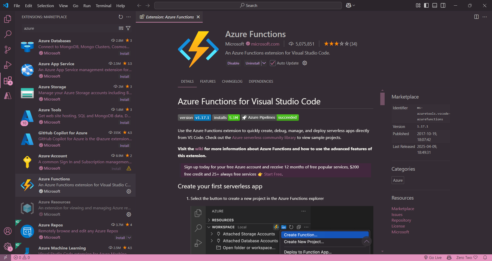

3. Despliegue la Function de Fibonacci a Azure usando Visual Studio Code. La primera vez que lo haga se le va a pedir autenticarse, siga las instrucciones.

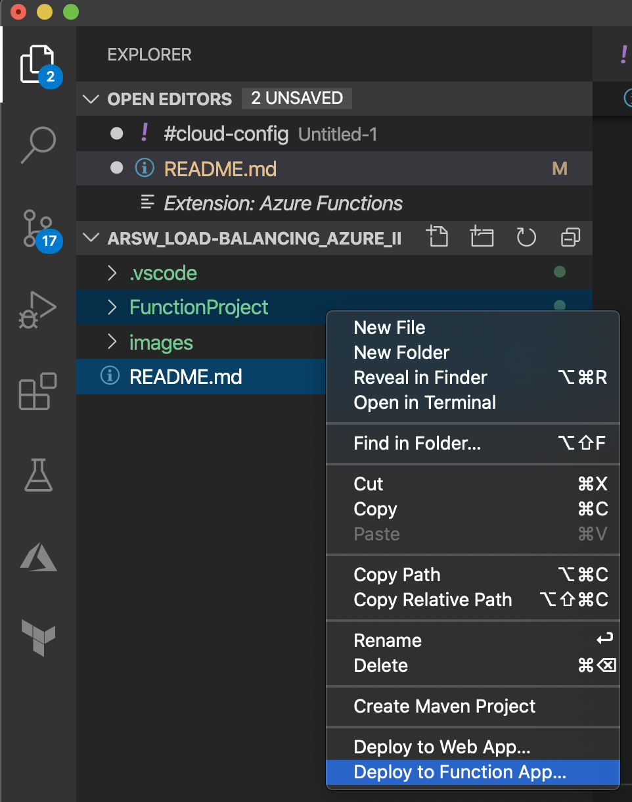

4. Dirijase al portal de Azure y pruebe la function.

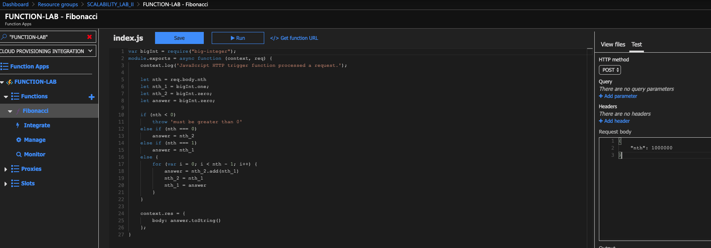

5. Modifique la coleción de POSTMAN con NEWMAN de tal forma que pueda enviar 10 peticiones concurrentes. Verifique los resultados y presente un informe.

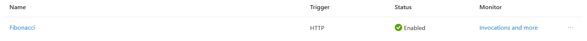
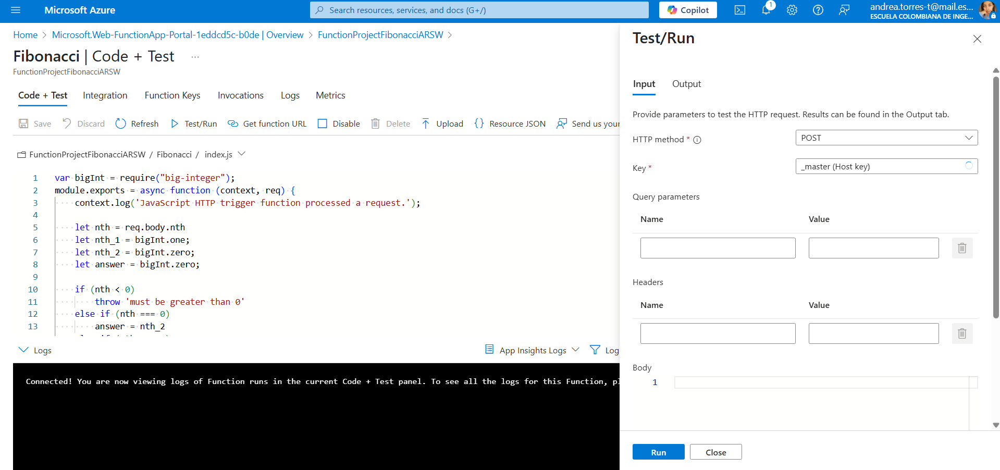
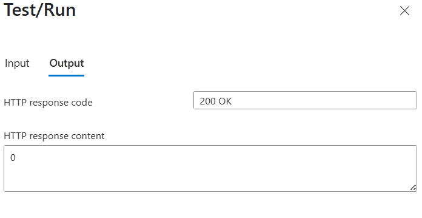
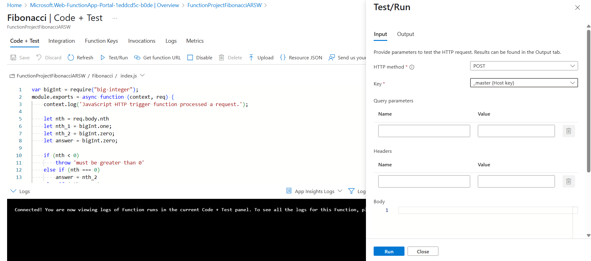
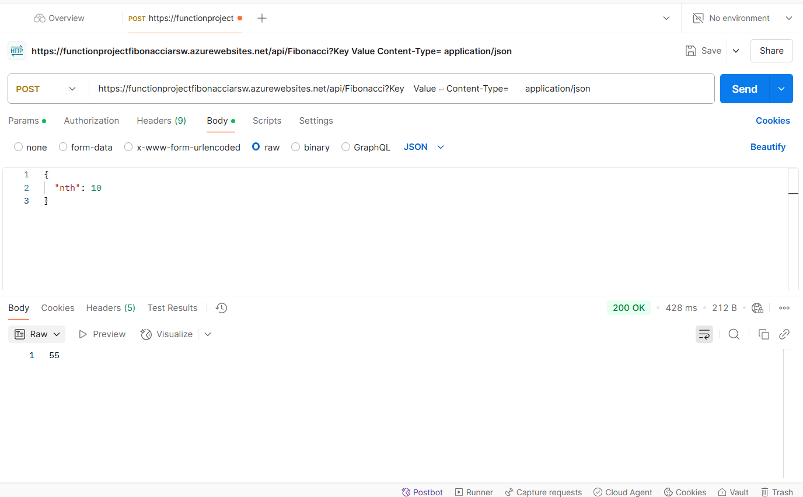
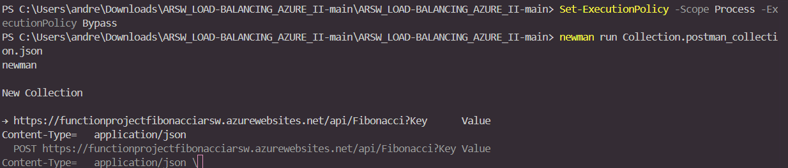
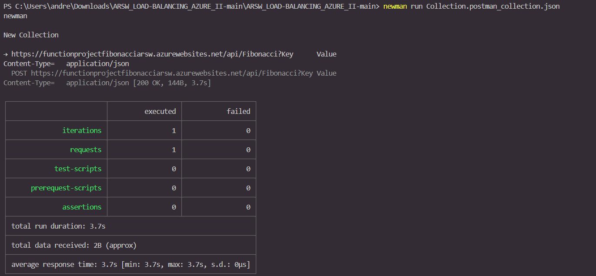

Al haccer recurrente 10 veces, se generaron resorte en html con toda la información

6. Cree una nueva Function que resuleva el problema de Fibonacci pero esta vez utilice un enfoque recursivo con memoization. Pruebe la función varias veces, después no haga nada por al menos 5 minutos. Pruebe la función de nuevo con los valores anteriores. ¿Cuál es el comportamiento?.

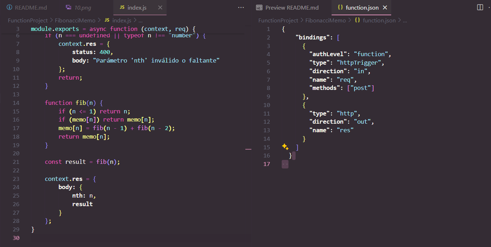
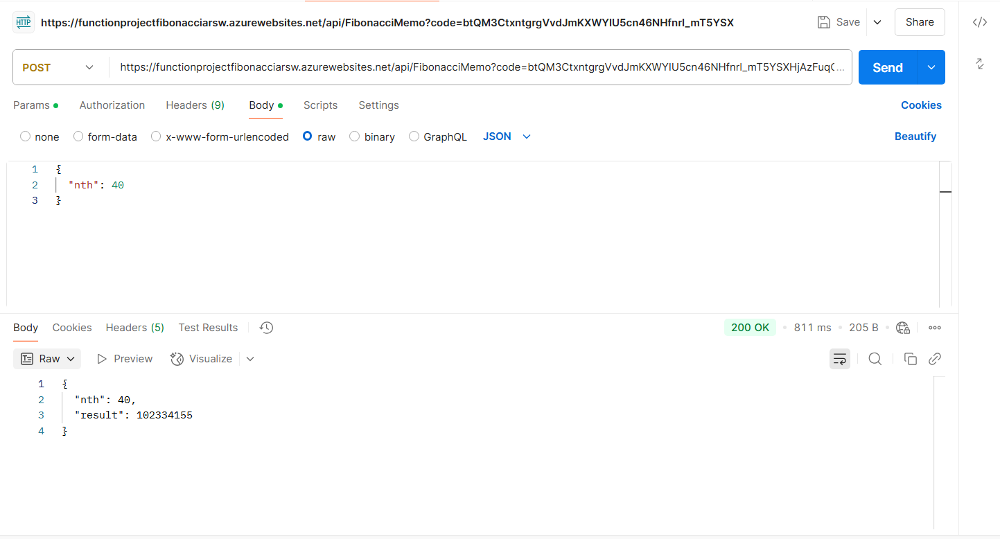
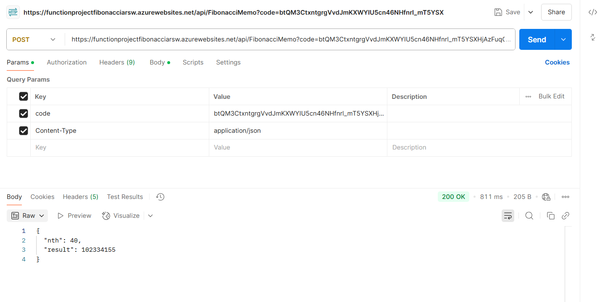

    Después de esos 5 minutos:

    La primera llamada será igual de lenta que al principio porque el estado de la función (el objeto memo) se pierde cuando la instancia se reinicia.

    Las llamadas posteriores serán rápidas otra vez mientras la instancia siga activa.

    Conclusión: Azure Functions son serverless y sin estado, por lo tanto, la memoization no se conserva entre ejecuciones separadas en el tiempo.

**Preguntas**

* ¿Qué es un Azure Function?

    Azure Function es un servicio serverless de Azure que permite ejecutar pequeñas piezas de código (funciones) en respuesta a eventos sin tener que gestionar la infraestructura subyacente.

* ¿Qué es serverless?

    Es un modelo de computación en la nube donde el proveedor (Azure) gestiona automáticamente los servidores. El usuario solo debe enfocarse en el código. El escalado es automático y se paga únicamente por el tiempo de ejecución de la función.

* ¿Qué es el runtime y qué implica seleccionarlo al momento de crear el Function App?

    El runtime es el entorno de ejecución que ejecuta las funciones (por ejemplo, .NET, Node.js, Python). Al seleccionarlo se definen:

    - El lenguaje de programación admitido.

    - Las bibliotecas compatibles.

    - El tipo de configuración y herramientas necesarias para el desarrollo y despliegue.

4. ¿Por qué es necesario crear un Storage Account con una Function App?

    Las Azure Functions necesitan un almacenamiento para:

    -  Mantener los logs y archivos temporales.

    - Almacenar metadatos y archivos de configuración.

    - Soportar el escalado y el state management del servicio.

5. ¿Cuáles son los tipos de planes para un Function App?

    Existen tres tipos principales de planes para una Function App en Azure:

    - Plan de Consumo: Es el más económico y se basa en un modelo de pago por uso. Azure asigna recursos dinámicamente y escala automáticamente según la demanda. Su principal ventaja es que solo se paga por el tiempo en que la función se ejecuta. Sin embargo, presenta un retraso conocido como “cold start” (inicio en frío) cuando la función no ha sido utilizada recientemente, y no permite mantener estado en memoria.

    - Plan Premium: Ofrece todas las ventajas del plan de consumo, pero sin tiempo de inicio en frío. Además, permite funciones con mayor duración, instancias precalentadas, acceso a redes virtuales (VNET) y escalabilidad más rápida. Es más costoso que el plan de consumo, pero ideal para aplicaciones críticas o de alto rendimiento.

    - App Service Plan: Ejecuta las funciones en instancias dedicadas, lo que permite mayor control sobre el entorno. Es útil cuando ya se tienen recursos disponibles en un App Service Plan y se desea compartirlos. Su desventaja principal es que el escalado no es automático como en los otros planes, y se paga por el tiempo de ejecución del plan independientemente del uso real.

6. ¿Por qué la memoization falla o no funciona correctamente?

    En un entorno serverless (como el plan de consumo), las instancias de la función pueden ser desasignadas cuando no están en uso. Como resultado, cualquier dato almacenado en memoria local se pierde. Por lo tanto, la memoization no es persistente.

7. ¿Cómo funciona el sistema de facturación de las Function App?

    Depende del tipo de plan:

    - Consumo: Se cobra por número de ejecuciones y duración (en GB-segundos).

    - Premium/App Service Plan: Se cobra por el número de instancias y tiempo de actividad, independientemente del uso.
